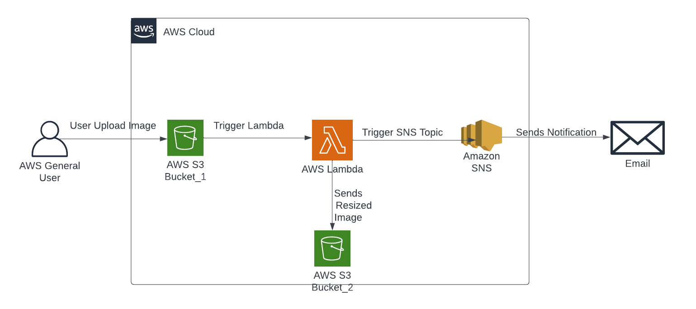

# Automated Image Resizing and Transfer System Using AWS Services

## Project Description:
This project focuses on building an automated system for image processing and management within the AWS ecosystem. The goal is to streamline the handling of images by automatically resizing them and transferring them to a designated storage location while keeping stakeholders informed through notifications. Key AWS services, such as Lambda, S3, and SNS, are used to orchestrate this workflow.

## Key Features:
1. Image processing automation: Automatically resize and optimize images upon upload.
2. Secure storage: Store processed images in a secure and reliable S3 bucket.
3. Real-time notifications: Receive immediate updates about image processing via SNS.
4. Scalable architecture: Design for scalability to handle image processing demands.
5. Cost-efficient solution: Leverage AWS serverless technologies to minimize operational costs.

## Overview :

## Steps :
### Step 1 :
### Creating Source and Designation s3 Buckets :

1. Navigate to the S3 Console.
2. Follow the Outlined Steps below.
3. Create the destination bucket using the same steps and name it with a unique name.
4. As you can see above , I created two buckets one is Source bucket and another one is Destination bucket.

### Step 2 :
### Creating the SNS Notification :

1. Navigate to the SNS console.
2. Follow the Outlined Steps below.
3. Scroll down and Click "Create subscription"  
4. After this , you will receive some mail for Subscription Confirmation and you have to confirm that. 
5. You can use any other protocols also like SQS, HTTP, SMS etc ., 

### Step 3 :
### Creating the Lambda :

1. Navigate to the Lambda Console.
2. Follow the Outlined steps below.
3. Now replace the default code with the image-resizing-s3.py and deploy the changes , Don't test the code now we have to do some more actions before testing.
4. After that , We have to give some permission for our Lambda Function to do our process (resizing) , For that navigate to the IAM Console and follow the below steps.
5. Now navigate to the Lambda Console and follow the steps below.
6. Now we have to trigger the function.
7. Now we have to go to code section , and scroll down to  layers. 
8. We have to add layer . 
9. May be you can think , why ? 
10. It's because for resize the image we upload in our source S3 bucket , We need a python library called pillow in our code to resize the image . We can manually add Pillow library also, But it's very time consuming and you have to do lot more , Instead of manually adding pillow library we are going to use layers for Some easy action. 
11. Follow the outlined Steps on AWS Console
13. After done all the actions above , now we can test our code.
14. It will show some results like below , It runs successfully but return some error because we still not upload the images in S3 yet.

### Step 4 :
### Results :

1. Navigate to the S3 Console.
2. Upload Some images in  Source Bucket.

### It Successfully resized the Image and sends me the Notification.

